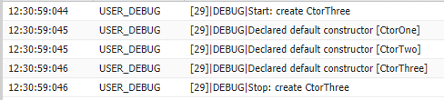

Using Constructors
------------------

A constructor is code that is invoked when an object is created from the class blueprint. You do not need to write a constructor for every class. If a class does not have a user-defined constructor, a default, no-argument, public constructor is used.

The syntax for a constructor is similar to a method, but it differs from a method definition in that it never has an explicit return type and it is not inherited by the object created from it.

After you write the constructor for a class, you must use the new keyword in order to instantiate an object from that class, using that constructor. For example, using the following class:

```Apex
public class TestObject {

   // The no argument constructor 
   public TestObject() {
      // more code here
  }
}
```

A new object of this type can be instantiated with the following code:

```Apex
TestObject myTest = new TestObject();
```

If you write a constructor that takes arguments, you can then use that constructor to create an object using those arguments.

If you create a constructor that takes arguments, and you still want to use a no-argument constructor, you must create your own no-argument constructor in your code. Once you create a constructor for a class, you no longer have access to the default, no-argument public constructor.

In Apex, a constructor can be overloaded, that is, there can be more than one constructor for a class, each having different parameters. The following example illustrates a class with two constructors: one with no arguments and one that takes a simple Integer argument. It also illustrates how one constructor calls another constructor using the this(...) syntax, also know as constructor chaining.

```Apex
public class TestObject2 {

private static final Integer DEFAULT_SIZE = 10;

Integer size;

   //Constructor with no arguments
   public TestObject2() {
       this(DEFAULT_SIZE); // Using this(...) calls the one argument constructor    
   }

   // Constructor with one argument 
   public TestObject2(Integer ObjectSize) {
     size = ObjectSize;  
   }
}
```

New objects of this type can be instantiated with the following code:

```Apex
TestObject2 myObject1 = new TestObject2(42);
TestObject2 myObject2 = new TestObject2();
```

Every constructor that you create for a class must have a different argument list. In the following example, all of the constructors are possible:

```Apex
public class Leads {

  // First a no-argument constructor 
  public Leads () {}

  // A constructor with one argument
  public Leads (Boolean call) {}

  // A constructor with two arguments
  public Leads (String email, Boolean call) {}

  // Though this constructor has the same arguments as the 
  // one above, they are in a different order, so this is legal
  public Leads (Boolean call, String email) {}
}
```

When you define a new class, you are defining a new data type. You can use class name in any place you can use other data type names, such as String, Boolean, or Account. If you define a variable whose type is a class, any object you assign to it must be an instance of that class or subclass.

### Constructors and inheritance

Given a base class (abstract/virtual or otherwise) with a non empty constructor

```Apex
public inherited sharing abstract class AbstractProduct {
    public AbstractProduct(String category) {}
}
```

Inherit from that base class without delaring any constructors, such as

```Apex
public inherited sharing class MusicSystem extends AbstractProduct {}
```

Pushing source (compile) will fail with `No default constructor available in super type: AbstractProduct (1:32)`

In order to get the code to push (compile) a non default constructor needs to be added to our extending class, the non default constructor must call the non default constructor on the base class (using the super keyword).

```Apex
public inherited sharing class MusicSystem extends AbstractProduct {
    public MusicSystem(String category) {
        super(category);
    }
}
```

If you do not call the non default constructor on the abstract (using the super keyword) then an attempt is made (by Apex) to call the abstracts default constructor, the empty constructor does not exist, therefore the code will not compile.

Apex constructors, like Java's are not members that can be inherited:

> A subclass inherits all the members (fields, methods, and nested classes) from its superclass. Constructors are not members, so they are not inherited by subclasses, but the constructor of the superclass can be invoked from the subclass.

[http://docs.oracle.com/javase/tutorial/java/IandI/subclasses.html](http://docs.oracle.com/javase/tutorial/java/IandI/subclasses.html)

Constructors are not inherited, but their execution is always chained such that the "most super" class constructor is executed first and the constructor for the class that you are explicitly constructing is called last.

By way of example we have an inheritance chanin with three virtual classes [CtorOne](CtorOne.cls), [CtorTwo](CtorTwo.cls) and [CtorThree](CtorThree.cls); each class has a default constructor with debug and CtorThree has a public static create method, running `` in an anonymous Apex window produces the following output



This is important to note as it allows the subclass to be ignorant of the implementation of the superclass and guarantees to the author of the superclass that it will have an opportunity to initialise itself before it is used, even if constructed by an unknown subclass constructor (which may or may not have arguments). This is, if you don't call call super explicitly it will be called implicitly.

To preserve the chain, the compiler will also provide a default zero argument constructor if you do not provide any constructors yourself

> If you write a constructor that takes arguments, you can then use that constructor to create an object using those arguments. If you create a constructor that takes arguments, and you still want to use a no-argument constructor, you must include one in your code. Once you create a constructor for a class, you no longer have access to the default, no-argument public constructor. You must create your own.

All this means that having created a constructor in an abstract/virtual class which takes an argument, you must also provide a zero argument constructor in order to extend the class.
