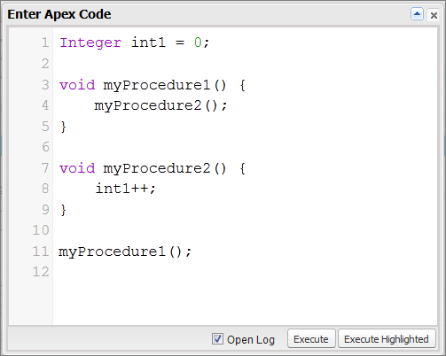

Executing Anonymous Apex Code
-----------------------------

The Developer Console allows you to execute Apex code as another way to generate debug logs that cover specific application logic.

USER PERMISSIONS NEEDED
To execute anonymous Apex:	“Author Apex”
The Execute Anonymous Apex tool in the Developer Console runs the Apex code you enter using ExecuteAnonymous and generates a debug log with the results of the execution.

*WARNING* If you call a class that contains a testMethod, all DML statements of the test method execute. This action can add unwanted data to your organization.

1. Click **Debug | Open Execute Anonymous Window** to open the Enter Apex Code window


2. Enter the code you want to run in the Enter Apex Code window or click Triangle icon to open the code editor in a new browser window. To automatically open the resulting debug log when execution is complete, select **Open Log**.

*NOTE* You can't use the keyword static in anonymous code.

3. Execute the code:
To execute all code in the window, click **Execute** or CTRL+E.
To execute only selected lines of code, select the lines and click **Execute Highlighted** or CTRL+SHIFT+E.

4. If you selected **Open Log**, the log will automatically open in the Log Inspector. After the code executes, the debug log will be listed on the **Logs** tab. Double-click the log to open it in the Log Inspector.

5. To execute the same code again without making changes, click **Debug | Execute Last**. If you want to modify the code, click **Debug | Open Execute Anonymous Window**, to open the Enter Apex Code window with the previous entry.

## Creating Classes in an Anonymous Apex Window

When you add a class declaration to an anonymous Apex window the classes are declared as virtual by default, see the example code below.

```Apex
public class ClassOne { ClassOne() { system.debug('ClassOne'); } }
public class ClassTwo extends ClassOne { ClassTwo() { system.debug('ClassTwo'); } }
public class ClassThree extends ClassTwo { ClassThree() { system.debug('ClassThree'); } }
ClassThree c = new ClassThree();
```