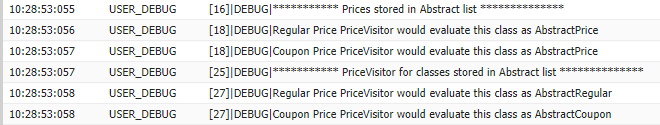
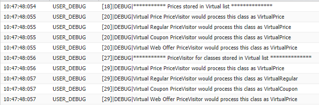

Apex Object Oriented Programming

According to [Salesforce] the Apex programming language is 
> Apex is a strongly typed, object-oriented programming language that allows developers to execute flow and transaction control statements on Salesforce servers in conjunction with calls to the API. Using syntax that looks like Java and acts like database stored procedures, Apex enables developers to add business logic to most system events, including button clicks, related record updates, and Visualforce pages. Apex code can be initiated by Web service requests and from triggers on objects.

Source: [https://developer.salesforce.com/docs/atlas.en-us.apexcode.meta/apexcode/apex_intro_what_is_apex.htm] 

Very little information can be found about the origins of the Apex language most believing it to be an early version of Java
> Apex syntax and semantics mimic Java, including:
> Variable and expression syntax
> Block and conditional syntax
> Loop syntax
> Object and array notation
> Pass by reference

Source: [https://developer.salesforce.com/page/A_Brief_Overview_of_the_Apex_Language]

In learning the Apex language we need to understand how it behaves when dealing with an object inheritance.

### Extending a Class (inheriting)
You can extend a class to provide more specialized behavior.

A class that extends another class inherits all the methods and properties of the extended class. In addition, the extending class can override the existing virtual methods by using the override keyword in the method definition. Overriding a virtual method allows you to provide a different implementation for an existing method. This means that the behavior of a particular method is different based on the object you’re calling it on. This is referred to as polymorphism.
NB: It is not clear if or how the constructor in inherited.

A class extends another class using the extends keyword in the class definition. A class can only extend one other class, but it can implement more than one interface.

Examples presented here are for a fictional sales app with prices inherited from an abstract or virtual class 
- AbstractPrice (Abstract class)
-- AbstractRegular (inherited from Abstract class)
-- AbstractCoupon (inherited from Abstract class)
- IPromotion (interface)
- VirtualPrice (Virtual class)
-- VirtualRegular (inherited from Virtual class)
-- VirtualCoupon (inherited from Virtual class)
-- VirtualWebOffer (inherited from Virtual class)

Tests are [AbstractClassTests.cls](AbstractClassTests.cls) and [VirtualClassTests.cls](VirtualClassTests.cls) the purpose of the tests to see how method overriding works along with how to up cast and down casting.

NB: A class can only extend a *Virtual* or *Abstract* class.  

Abstract classes - cannot instantiate, must override.
Virtual classes - can instantiate and give default method behavior, overriding methods is optional.

[AbstractPriceList.cls](AbstractPriceList.cls) and [VirtualPriceList.cls](VirtualPriceList.cls) elaborate on the tests by storing instances of the classes in the abstract or virtual state and call overloaded methods to see how dispatch is working; Apex works in the same way as Java and the expected way for an Object Orientated language of it's type by calling the method that matches the abstract/virtual or if no matches will call the method for Object. C# is one of the languages that differs from this as it has a dynamic runtime library and can dispatch to an exact method. The output of these classes is below.

### Extended Class Example

The [OuterClass](OuterClass.cls) is an example from Salesforce and illustrates:
- A top-level class definition (also called an outer class)
- Static variables and static methods in the top-level class, as well as static initialization code blocks
- Member variables and methods for the top-level class
- Classes with no user-defined constructor — these have an implicit, no-argument constructor
- An interface definition in the top-level class
- An interface that extends another interface
- Inner class definitions (one level deep) within a top-level class
- A class that implements an interface (and, therefore, its associated sub-interface) by implementing public versions of the method signatures
- An inner class constructor definition and invocation
- An inner class member variable and a reference to it using the this keyword (with no arguments)
- An inner class constructor that uses the this keyword (with arguments) to invoke a different constructor
- Initialization code outside of constructors — both where variables are defined, as well as with anonymous blocks in curly braces ({}). Note that these execute with every construction in the order they appear in the file, as with Java.
- Class extension and an abstract class
- Methods that override base class methods (which must be declared virtual)
- The override keyword for methods that override subclass methods
- Abstract methods and their implementation by concrete sub-classes
- The protected access modifier
- Exceptions as first class objects with members, methods, and constructors

The [OuterClassTests](OuterClassTests.cls) illustrates:
- Construction of the outer class
- Construction of an inner class and the declaration of an inner interface type
- A variable declared as an interface type can be assigned an instance of a class that implements that interface
- Casting an interface variable to be a class type that implements that interface (after verifying this using the instanceof operator)

[Salesforce]: https://www.salesforce.com/uk/
