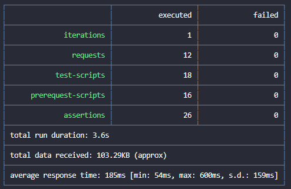

Using the standard object collection
------------------------------------

### Pre-requisites
Download and install [Postman] (may require sign up)
Salesforce Org

### Use
Open Postman and [import] `Standard Objects.postman_collection.json` 

Obtain Salesforce Auth Token for your org.

[Edit] the collection, select variables, in the current value column

- Copy your Auth Token to the access token variable
- Copy your Org URL to the orgurl variable

For everything else copy the initial value to the current value.

If everything has worked correctly you can expand the items in the collection and make API calls into the Org.

The collection includes
- Pre-Request scripts at the environment level; these apply to all requests
- Post-Request scripts (Tests) at the request level; these apply to a single request
- Formatted response using Templates (see visualiser for Salesforce Limits request)
- Shape of the response using tv4 (see Failure - No Auth 401) although if you import an OpenAPI schema and associate it with a test suite this will be done automatically
- Creation of data using one of the Composite API calls
- Dynamic Environment variables created to store ID's of data created in the session for later deletion

Newman
------
Newman is a Postman collection command line runner. It allows you to run and test a Postman collection directly from the command-line. Newman maintains feature parity with Postman and allows you to run collections the same way they are executed inside the collection runner in Postman.

In order to run Newman with a Salesforce API collection we need to obtain an Auth token; in order to do that there is a simple Node/JavaScript [newman-standard-object-runner.js](newman-standard-object-runner.js) running that calls the Salesforce CLI (sfdx) to obtain details of the Scratch Org then subsequently calls Newman setting environment variables.

To run the script
- Install [Salesforce CLI]
- Install [Nodejs]
- Install [Newman from NPM](https://www.npmjs.com/package/newman)
- Open command window and run `node newman-standard-object-runner.js`

All being well Newman will run through the requests in the collection calling each endpoint in turn.

[Postman]: https://www.postman.com/ "www.postman.com"
[import]: https://learning.postman.com/docs/getting-started/importing-and-exporting-data/ "import postman data"
[edit]: https://learning.postman.com/docs/getting-started/importing-and-exporting-data/ "edit postman collection"
[Newman]: https://learning.postman.com/docs/running-collections/using-newman-cli/command-line-integration-with-newman/
[Salesforce CLI]: https://developer.salesforce.com/tools/sfdxcli
[Nodejs]: https://nodejs.org/en/
